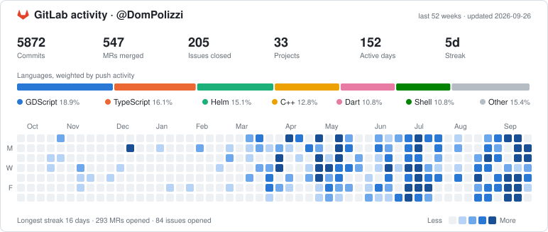

# Hi, I'm Dom 👋

Most of my day-to-day work lives on **GitLab**, where projects stay private until they're in a state I'm happy to show. The card below is generated daily from my GitLab activity so the picture here stays honest.

<a href="https://gitlab.com/DomPolizzi">
  <picture>
    <source media="(prefers-color-scheme: dark)" srcset="assets/gitlab-stats-dark.svg">
    
  </picture>
</a>

**Find me on GitLab:** [@DomPolizzi](https://gitlab.com/DomPolizzi) · [void-realm-solutions](https://gitlab.com/void-realm-solutions)

---

The card is rendered by <code>scripts/gitlab_stats.py</code> via a scheduled GitHub Action using a read-only GitLab token. Only aggregate numbers are published.
